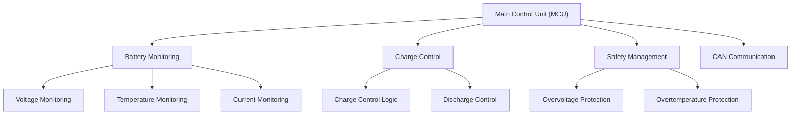

# Battery Management System (BMS) for FSAE

This project implements a simplified Battery Management System (BMS) firmware for a Formula SAE (FSAE) car using the STM32F446RET microcontroller. The BMS is responsible for monitoring battery voltage, current, and temperature, controlling charge and discharge, and providing safety mechanisms such as overvoltage and overtemperature protection.

---

## System Overview

The BMS consists of several components:
- **Voltage Monitoring**: Measures the voltage of individual battery cells.
- **Current Monitoring**: Tracks the current flowing in and out of the battery.
- **Temperature Monitoring**: Uses I2C-based sensors to monitor the battery temperature.
- **Charge/Discharge Control**: Manages relays or MOSFETs for charging and discharging the battery.
- **Safety Management**: Implements overvoltage and overtemperature protection mechanisms.
- **CAN Communication**: Sends and receives data between different systems in the vehicle using the CAN bus.

### Mermaid Diagram

Here is a high-level diagram showing the interactions between the main components of the BMS:

---

## Pin Assignments

The following table lists the pin assignments for the key components of the BMS, based on the STM32F446RET microcontroller:

| **Function**                  | **Pin Name**                  | **Pin Description**         |
|-------------------------------|-------------------------------|-----------------------------|
| **Voltage Monitoring**         | `ADC_Voltage_Pin`             | PA0 (ADC1_IN0)              |
| **Current Monitoring**         | `ADC_Current_Pin`             | PA1 (ADC1_IN1)              |
| **Charge Control**             | `Charge_Control_Pin`          | PA4                         |
| **Discharge Control**          | `Discharge_Control_Pin`       | PA5                         |
| **CAN Transmit (TX)**          | `CAN1_TX_Pin`                 | PA12                        |
| **CAN Receive (RX)**           | `CAN1_RX_Pin`                 | PA11                        |
| **I2C1 SDA (Temp Sensor)**     | `I2C1_SDA_Pin`                | PB7                         |
| **I2C1 SCL (Temp Sensor)**     | `I2C1_SCL_Pin`                | PB6                         |
| **Overvoltage Protection**     | `Overvoltage_Protection_Pin`  | PB8                         |
| **Overtemperature Protection** | `Overtemperature_Protection_Pin` | PB9                      |
| **Status LED**                 | `LD2_Pin`                    | PA5                         |