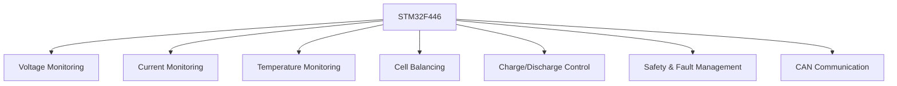
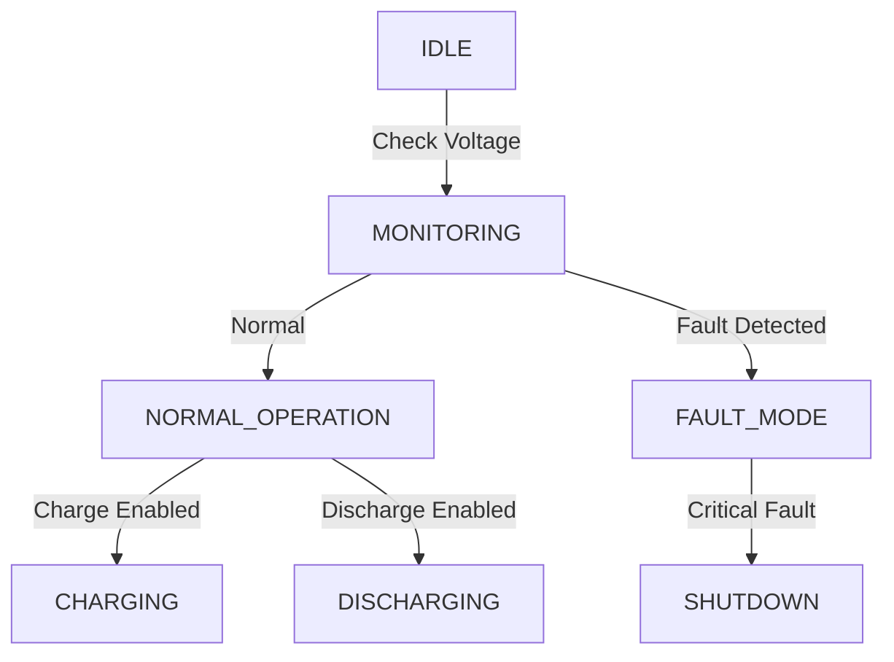

#  Sample BMS for FSAE

## **1. Overview**
This document outlines the architecture and design considerations for a Battery Management System tailored for an **FSAE electric race car**. The system is built around the **STM32F446RET** microcontroller and is responsible for **monitoring, protection, control, and communication** of the battery pack.

### **1.1 Objectives**
- **Monitor** individual **cell voltages, pack current, and temperature**.
- **Ensure safety** through overvoltage, undervoltage, overtemperature, and overcurrent protection.
- **Control charge and discharge** via **MOSFET-based switching circuits**.
- **Enable cell balancing** to maintain battery health and longevity.
- **Transmit real-time battery data** over **CAN bus** to the vehicle control system.
- **Support fault detection and logging** for debugging and safety compliance.

---

## **2. System Architecture**
The BMS consists of multiple subsystems that interact to ensure safe and efficient battery operation.

### **2.1 Key Components**
- **Microcontroller:** STM32F446RET (Cortex-M4)
- **Voltage Measurement:** ADC + Voltage Dividers
- **Current Measurement:** Hall Effect Sensor or Shunt Resistor
- **Temperature Sensors:** NTC Thermistors or I2C-based sensors (TMP102)
- **Cell Balancing:** Passive balancing using MOSFETs
- **Communication:** CAN Bus (ISO 11898 standard)
- **Power Control:** MOSFETs for charge and discharge control

---

## **3. Assumptions & Design Choices**

### **3.1 Battery Pack Design**
| Parameter               | Value |
|------------------------|-------|
| Cell Chemistry         | Li-ion |
| Configuration         | 6S (6-series) |
| Cell Voltage Range     | 3.0V - 4.2V |
| Pack Voltage Range     | 18V - 25.2V |
| Max Discharge Current | 100A |
| Max Charge Current    | 50A |

### **3.2 Safety Considerations**
| Condition          | Threshold  | Action |
|--------------------|------------|---------|
| Overvoltage       | >4.2V (cell) | Disable charging |
| Undervoltage      | <3.0V (cell) | Disable discharge |
| Overtemperature   | >60°C | Activate cooling / Disable charge/discharge |
| Overcurrent       | >110A | Shut down system |

### **3.3 Control Strategy**
- **Charge/Discharge Control**
  - Controlled using MOSFET switches.
  - Based on SoC  and safety conditions.

- **Cell Balancing**
  - Passive balancing using MOSFETs to dissipate excess charge as heat.
  - Only activates when **cell voltage difference exceeds 50mV**.

- ** SoC Estimation**
  - Uses a combination of **open circuit voltage (OCV) method** and **Coulomb counting**.

---

## **4. Hardware Design**

### **4.1 Pin Assignments (STM32F446RET)**
| Function                  | Pin Name    | Description |
|--------------------------|------------|-------------|
| **Voltage Sensing**       | PA0-PA5    | ADC Inputs (Cell Voltages) |
| **Current Sensing**       | PA6        | ADC Input (Shunt Resistor) |
| **Temperature Sensing**   | PB6, PB7   | I2C (External Sensors) |
| **Charge Control**        | PA8        | MOSFET Gate Drive |
| **Discharge Control**     | PA9        | MOSFET Gate Drive |
| **Cell Balancing**        | PB0-PB5    | GPIO (MOSFET Control) |
| **CAN Bus TX/RX**         | PA11, PA12 | CAN Communication |
| **Overvoltage Protection** | PB8        | GPIO Output |
| **Overtemperature Protection** | PB9    | GPIO Output |
| **Status LED**            | PA10       | GPIO Output |

---

## **5. Communication (CAN Bus Protocol)**

### **5.1 CAN Message Format**
| **Message ID** | **Data**                  | **Description** |
|--------------|--------------------------|----------------|
| 0x100       | Voltage (mV) per cell      | Broadcast every 1s |
| 0x101       | Current (mA)               | Broadcast every 1s |
| 0x102       | Temperature (°C) per sensor | Broadcast every 1s |
| 0x103       | SoC (%)                    | Broadcast every 1s |
| 0x104       | Safety Flags               | Overvoltage, Overtemp |

---

## **6. Software Design**

### **6.1 Tasks & Execution Flow**
The BMS firmware runs on **FreeRTOS** with the following tasks:

| Task Name        | Functionality |
|------------------|--------------|
| **Voltage Task** | Reads cell voltages periodically via ADC |
| **Current Task** | Reads current via ADC and calculates SoC |
| **Temperature Task** | Reads battery temperature via I2C |
| **Safety Task** | Monitors safety conditions and takes action |
| **Balancing Task** | Activates balancing based on voltage differences |
| **CAN Task** | Transmits battery data via CAN bus |

### **6.2 State Machine**

